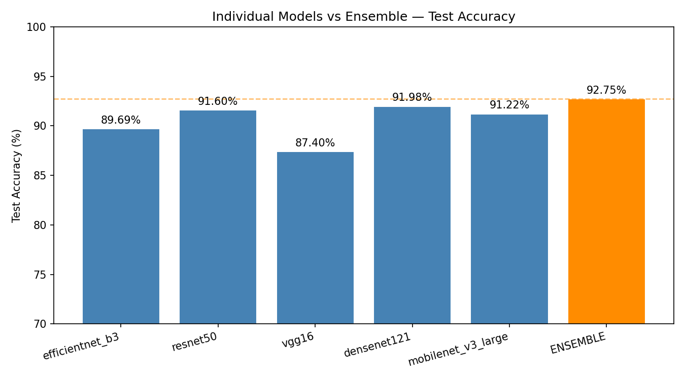
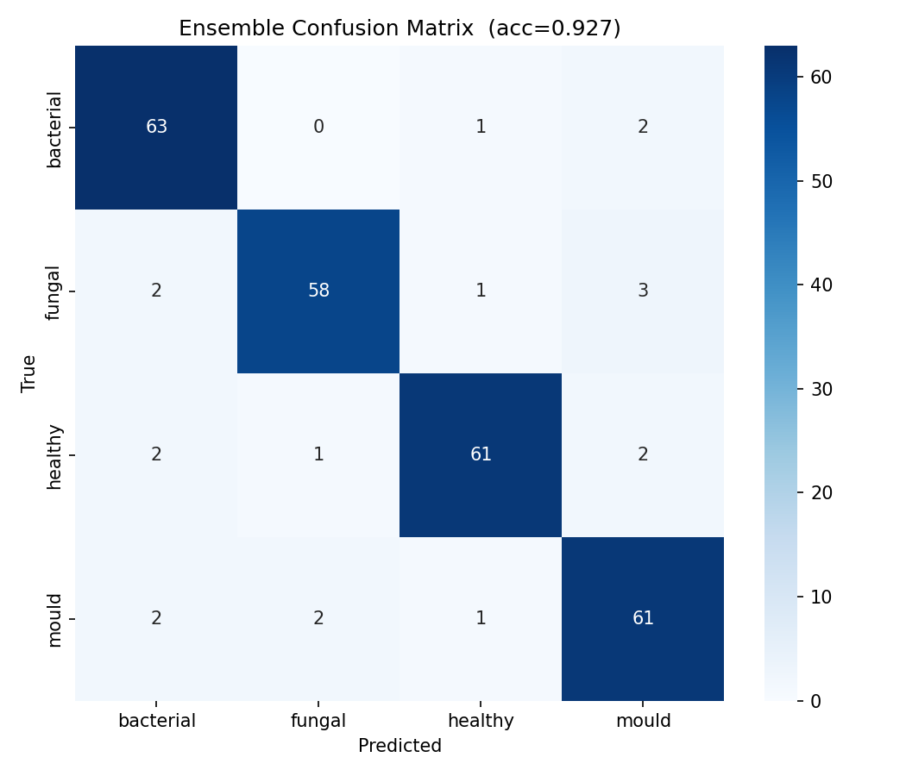
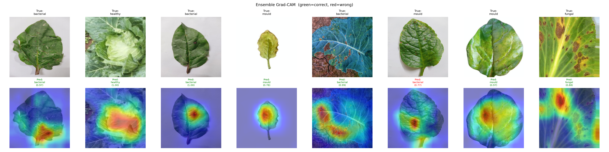

# Plant Pathogen Classification Using CNN Ensemble
### Deep Learning-Based Detection of Pathogen Types in Leafy Vegetables

[](https://python.org)
[](https://pytorch.org)
[]()
[]()
[](ResearchPaper.pdf)

---

## Research Paper

The full IEEE-format research paper is available here: **[ResearchPaper.pdf](ResearchPaper.pdf)**

---

## Abstract

This project presents a deep learning pipeline for classifying plant leaf images into four pathogen categories — **bacterial**, **fungal**, **mould**, and **healthy** — across four leafy vegetables: cabbage, cauliflower, spinach, and lettuce. Unlike existing work that identifies individual disease names on a single crop, this system classifies by *pathogen type*, which directly informs treatment decisions regardless of crop species.

Five pre-trained CNN architectures (EfficientNet-B3, ResNet-50, VGG-16, DenseNet-121, MobileNet-V3-Large) are fine-tuned using a two-phase transfer learning strategy and combined via **probability averaging ensemble**, achieving **92.75% test accuracy** and **99.05% macro AUC-ROC** on a dataset of 1,742 images. Grad-CAM visualisations confirm that the model correctly attends to disease lesion regions.

---

## Results

### Individual Model vs Ensemble — Test Accuracy

| Model             | Parameters | Test Accuracy |
|-------------------|-----------|---------------|
| EfficientNet-B3   | 10.7M     | 89.69%        |
| ResNet-50         | 23.5M     | 91.60%        |
| VGG-16            | 134.3M    | 87.40%        |
| DenseNet-121      | 7.0M      | 91.98%        |
| MobileNet-V3-Large| 4.2M      | 91.22%        |
| **Ensemble**      | —         | **92.75%**    |

### Ensemble Classification Report

| Class      | Precision | Recall | F1-Score |
|------------|-----------|--------|----------|
| Bacterial  | 91.30%    | 95.45% | 93.33%   |
| Fungal     | 95.08%    | 90.62% | 92.80%   |
| Healthy    | 95.31%    | 92.42% | 93.85%   |
| Mould      | 89.71%    | 92.42% | 91.04%   |
| **Macro**  | **92.85%**| **92.73%** | **92.76%** |

**Macro AUC-ROC: 99.05%**

### Output Visualisations

| Model Comparison | Confusion Matrix |
|---|---|
|  |  |

| Ensemble Grad-CAM |
|---|
|  |

---

## Repository Structure

```
pathogen_classification/
├── README.md                        # This file
├── requirements.txt                 # Python dependencies
├── data/
│   └── README.md                    # Dataset structure & download guide
├── src/
│   ├── dataset.py                   # Data loading, augmentation, stratified splits
│   ├── model.py                     # All 5 CNN architectures + freeze/unfreeze helpers
│   ├── train.py                     # Single-model training (two-phase transfer learning)
│   ├── train_all.py                 # Sequential training of all 5 architectures
│   ├── ensemble.py                  # Ensemble inference, evaluation & Grad-CAM
│   ├── evaluate.py                  # Single-model evaluation (metrics + Grad-CAM)
│   └── predict.py                   # Single image inference (CLI)
├── results/
│   ├── model_comparison.png         # Bar chart: individual vs ensemble accuracy
│   ├── ensemble_confusion_matrix.png
│   ├── ensemble_gradcam.png         # Grad-CAM heatmaps (4 models averaged)
│   ├── ensemble_report.txt          # Full classification report
│   ├── confusion_matrix.png         # EfficientNet-B3 single-model matrix
│   └── training_curves.png          # Loss & accuracy curves
├── logs/
│   ├── training_log.csv             # EfficientNet-B3 epoch-level metrics
│   ├── training_log_resnet50.csv
│   ├── training_log_densenet121.csv
│   ├── training_log_mobilenet_v3_large.csv
│   └── training_log_vgg16.csv
└── checkpoints/                     # Saved model weights (not tracked in git)
```

---

## Dataset

The dataset contains **1,742 leaf images** across 4 pathogen classes:

| Class      | Images | Diseases Covered |
|------------|--------|-----------------|
| Bacterial  | 440    | Black rot, bacterial leaf spot |
| Fungal     | 423    | Alternaria, ring spot, septoria blight, anthracnose |
| Healthy    | 440    | Healthy leaves |
| Mould      | 439    | Downy mildew, powdery mildew |

**Crops covered:** Cabbage, Cauliflower, Spinach, Lettuce

See [`data/README.md`](data/README.md) for the full folder structure and how to set up the dataset.

---

## Setup

### 1. Clone the repository
```bash
git clone https://github.com/kushal-script/pathogen_classification.git
cd pathogen_classification
```

### 2. Create environment
```bash
# Using conda (recommended)
conda create -n pathogen python=3.12
conda activate pathogen

# Install dependencies
pip install -r requirements.txt
```

### 3. Set up dataset
Follow instructions in [`data/README.md`](data/README.md) to organise your dataset into:
```
dataset/flat/
├── bacterial/
├── fungal/
├── healthy/
└── mould/
```

---

## Training

### Train all 5 models sequentially (recommended)
```bash
cd src
python train_all.py --phase1_epochs 10 --phase2_epochs 30 --batch_size 32
```
Automatically skips architectures whose checkpoints already exist.

### Train a single architecture
```bash
python train.py --arch efficientnet_b3
python train.py --arch resnet50
python train.py --arch vgg16          # uses 224×224 input (MPS constraint)
python train.py --arch densenet121
python train.py --arch mobilenet_v3_large
```

### Training arguments
| Argument | Default | Description |
|---|---|---|
| `--arch` | `efficientnet_b3` | Architecture to train |
| `--phase1_epochs` | 10 | Epochs to train classifier head only |
| `--phase2_epochs` | 30 | Epochs to fine-tune all layers |
| `--batch_size` | 32 | Batch size (use 16 for VGG-16) |
| `--finetune_lr` | 1e-4 | Backbone LR in Phase 2 (head gets 10×) |
| `--force` | False | Retrain even if checkpoint exists |

---

## Two-Phase Transfer Learning

```
Phase 1 — Head only (10 epochs)
  ImageNet weights ──► [FROZEN]
                           │
                    Classifier head ──► [TRAINABLE]
  → Stabilises the randomly initialised head before touching backbone weights

Phase 2 — Full fine-tune (30 epochs)
  ImageNet weights ──► [LR = 1e-4]
                           │
                    Classifier head ──► [LR = 1e-3]
  → Backbone slowly adapts to leaf disease features with differential learning rates
```

---

## Evaluation

### Run ensemble evaluation (all 5 models)
```bash
cd src
python ensemble.py
# outputs: results/ensemble_confusion_matrix.png
#          results/model_comparison.png
#          results/ensemble_gradcam.png
#          results/ensemble_report.txt
```

### Single model evaluation
```bash
python evaluate.py
# evaluates best_efficientnet_b3.pt by default
```

### Single image prediction
```bash
python predict.py /path/to/leaf_image.jpg
```
Output:
```
Predicted : fungal  (97.34% confidence)

Class probabilities (ensemble average):
  fungal         0.9734  ########################################
  mould          0.0183  
  bacterial      0.0061  
  healthy        0.0022  
```

---

## Architecture Overview

```
Input Image (300×300 or 224×224 for VGG-16)
        │
        ├──► EfficientNet-B3  ──► softmax(4) ──► P₁
        ├──► ResNet-50        ──► softmax(4) ──► P₂
        ├──► VGG-16           ──► softmax(4) ──► P₃
        ├──► DenseNet-121     ──► softmax(4) ──► P₄
        └──► MobileNet-V3-L   ──► softmax(4) ──► P₅
                                                  │
                              Probability Averaging: (P₁+P₂+P₃+P₄+P₅) / 5
                                                  │
                                          argmax → Predicted Class
```

---

## Dependencies

```
torch>=2.0
torchvision>=0.15
opencv-python
Pillow
scikit-learn
matplotlib
seaborn
numpy
segment-anything
```

---

## Citation

If you use this work, please cite:
```
@misc{pathogen_classification_2025,
  title   = {Plant Pathogen Classification Using CNN Ensemble},
  author  = {Sathyanarayan, Kushal},
  year    = {2025},
  url     = {https://github.com/kushal-script/pathogen_classification}
}
```

---

## License
MIT License — see [LICENSE](LICENSE) for details.
